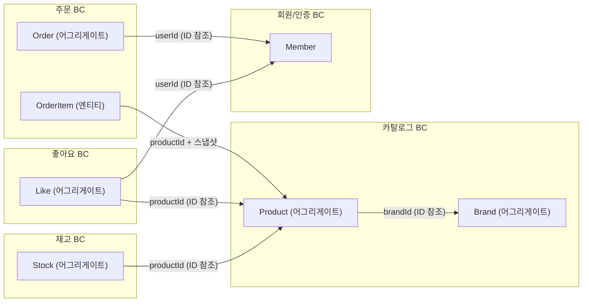
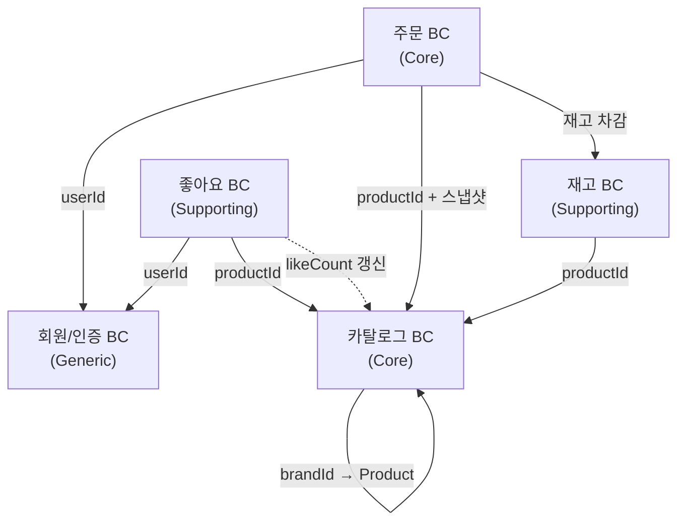
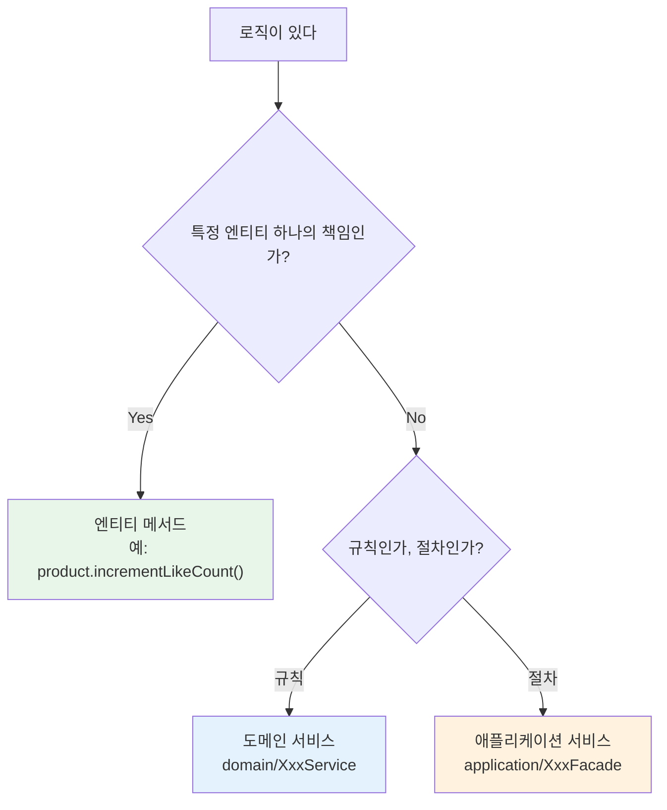

# DDD 설계 프레임워크

> 이 프로젝트의 도메인 설계 시 참조하는 사고 프레임워크.
> 실제 설계 과정에서 흐름을 검토하고, DDD 정석과 대조하여 조정한 결과물이다.

---

## 1. DDD 설계 흐름 (수정 전 vs 수정 후)

### 원래 흐름

```
1. 최상위 도메인 구분
2. 유비쿼터스 언어 구분
3. 바운디드 컨텍스트 구분
4. 루트 어그리게이트
5. 레이어 구분
6. 도메인 서비스 / 비즈니스 서비스
```

### 조정된 흐름 (DDD 정석)

```
1. 서브도메인 식별 + 분류 (Core / Supporting / Generic)
2. 유비쿼터스 언어 ↔ 바운디드 컨텍스트 (동시 발견)
3. 컨텍스트 매핑 (관계 정의)
4. 전술적 설계 (어그리게이트 + 엔티티/VO + 도메인 이벤트)
5. 레이어드 아키텍처 (구현)
6. 도메인 서비스 vs 애플리케이션 서비스 (용어 정정)
```

### 대조표

```
수정 전                            수정 후
─────────────────                  ─────────────────
1. 최상위 도메인 구분         →    1. 서브도메인 식별 + 분류 (Core/Supporting/Generic)
2. 유비쿼터스 언어 구분       ┐    2. 유비쿼터스 언어 ↔ 바운디드 컨텍스트 (동시 발견)
3. 바운디드 컨텍스트 구분     ┘
   (빠짐)                    →    3. 컨텍스트 매핑 (관계 정의)
4. 루트 어그리게이트          →    4. 전술적 설계 (어그리게이트 + 엔티티/VO + 도메인 이벤트)
5. 레이어 구분               →    5. 레이어드 아키텍처 (구현)
6. 도메인 서비스/비즈니스 서비스 →  6. 도메인 서비스 vs 애플리케이션 서비스 (용어 정정)
```

**3가지 핵심 조정 사항:**
1. **2번과 3번은 분리된 단계가 아니라 하나의 동시 과정** — 언어 차이를 발견하는 것이 곧 경계를 긋는 것
2. **컨텍스트 매핑이 누락** — 나눈 컨텍스트들의 통신 방식을 정의해야 함
3. **"비즈니스 서비스"는 DDD 용어가 아님** — "애플리케이션 서비스"로 정정

---

## 2. 각 단계 상세

### 2-1. 서브도메인 식별 + 분류

> "이 사업에서 뭘 하는가"를 영역별로 쪼개고, 어디에 설계 역량을 집중할지 결정한다.

"최상위 도메인"이라는 표현은 방향은 맞지만, DDD에서는 **서브도메인(Subdomain)**이라는 더 구체적인 분류 기준을 사용한다.

**서브도메인의 3가지 유형:**

| 유형 | 의미 | 설계 전략 |
|------|------|-----------|
| **Core** | 비즈니스 경쟁력의 핵심 | 직접 설계하고 정교하게 구현 |
| **Supporting** | Core를 보조. 중요하지만 차별화 요소는 아님 | 직접 구현하되 Core만큼의 투자는 불필요 |
| **Generic** | 어디서나 비슷하게 필요한 범용 기능 | 외부 솔루션 사용 가능 |

이 분류가 왜 필요한가: Core 서브도메인은 직접 정교하게 설계하고, Generic은 외부 솔루션을 쓸 수 있다.
"어디에 시간을 쓸 것인가"의 판단 근거가 된다.

### 2-2. 유비쿼터스 언어 ↔ 바운디드 컨텍스트 (동시 발견)

> "상품이 뭔데?"라고 물었을 때 대답이 달라지는 지점이 곧 경계다.
> 언어 차이를 발견하는 것과 경계를 긋는 것은 같은 행위의 양면이다.

**비유:** 지도에서 국경선을 긋는 것과 각 나라의 공용어를 정하는 것. "여기서부터 이 언어가 통하지 않는다"를 발견하는 순간이 곧 국경선이 그어지는 순간이다. 언어를 먼저 정하고 국경을 그리는 게 아니라, **언어 차이가 국경을 드러낸다.**

**판별 기준:** "같은 단어가 다른 속성/행위를 요구하는 지점 = 바운디드 컨텍스트 경계"

**적용 범위 한정:** 이 기준은 **동일 도메인 용어가 여러 맥락에서 사용될 때만** 적용된다. 애초에 다른 단어를 쓰는 영역(예: "상품"과 "결제수단")은 비즈니스 관심사 자체가 다르므로 별도 컨텍스트다.

### 2-3. 컨텍스트 매핑

> 바운디드 컨텍스트를 나눴으면, "얘네가 서로 어떻게 대화하는가"를 정해야 한다.

현재 프로젝트에서 **Facade가 이 역할을 수행**하고 있다. 모놀리스에서는 직접 호출이 실용적이지만, 시스템이 커졌을 때 **어디서 잘라야 하는가**를 미리 인식하는 단계다.

### 2-4. 전술적 설계

> 바운디드 컨텍스트 안에서 결정하는 것들.

| 결정 사항 | 질문 | 프로젝트 예시 |
|-----------|------|--------------|
| **어그리게이트 경계** | 어디까지가 하나의 트랜잭션 단위인가? | Product와 Stock은 별도 어그리게이트 |
| **엔티티 vs 값 객체** | 이 객체에 고유 식별자가 필요한가? | `Money`는 VO, `ProductModel`은 엔티티 |
| **도메인 이벤트** | 컨텍스트 간 통신은 어떻게? | 좋아요 생성 → likeCount 갱신 |

### 2-5. 레이어드 아키텍처 (구현)

전략적/전술적 설계가 끝난 후 코드로 옮기는 단계.

```
interfaces/      → 외부 요청 수신 (Controller, DTO)
application/     → 유스케이스 조율 (Facade)
domain/          → 비즈니스 규칙 (Entity, VO, DomainService)
infrastructure/  → 기술 구현 (JpaRepository)
```

### 2-6. 도메인 서비스 vs 애플리케이션 서비스

> "비즈니스 서비스"는 DDD 용어가 아니다. 구분하려는 것은 아래 두 가지다.

|  | 도메인 서비스 | 애플리케이션 서비스 |
|---|---|---|
| **현재 프로젝트** | `domain/XxxService` | `application/XxxFacade` |
| **담는 것** | 비즈니스 **규칙** | 유스케이스 **절차** |
| **판별 질문** | "이 로직이 특정 엔티티 하나의 책임인가?" → No → 도메인 서비스 | "이것은 규칙인가, 절차인가?" → 절차 → 애플리케이션 서비스 |

**적용 범위:** 이 "규칙 vs 절차" 구분은 **도메인 계층과 애플리케이션 계층 사이**에서만 유효하다. Controller(HTTP 변환)나 Repository(데이터 접근)에는 적용하지 않는다.

---

## 3. 현재 프로젝트의 서브도메인 분류표

| 서브도메인 | 유형 | 근거 |
|-----------|------|------|
| **카탈로그** (상품 + 브랜드) | Core | 고객에게 보여줄 상품을 관리. 비즈니스 전시의 핵심 |
| **주문** | Core | 거래를 기록하고 관리. 매출의 직접적 근간 |
| **재고** | Supporting | 주문과 카탈로그를 보조. 중요하지만 독자적 경쟁력은 아님 |
| **좋아요** | Supporting | 고객 선호 추적. 카탈로그 정렬(인기순)에 활용 |
| **회원/인증** | Generic | 어디서나 비슷한 범용 기능. 외부 솔루션 대체 가능 |

**Member가 다른 도메인과 완전히 독립적인 이유:**
회원 인증은 Generic 서브도메인이다. 다른 비즈니스 로직과 결합될 이유가 없으며, 현재 프로젝트에서도 `userId`만으로 참조하고 있다.

---

## 4. 바운디드 컨텍스트 발견 과정

### "상품이 뭔데?" — 같은 단어, 다른 의미

현재 `ProductModel`에 모든 관심사가 한 엔티티에 모여있다:

```java
public class ProductModel extends BaseEntity {
    private String name;        // ← "상품을 전시한다" 관점
    private String description; // ← "상품을 전시한다" 관점
    private Money price;        // ← "상품의 가치를 매긴다" 관점
    private Long brandId;       // ← "상품이 어떤 브랜드인지" 관점
    private int likeCount;      // ← "상품이 얼마나 인기있는지" 관점
}
```

"상품이 뭔데?"라고 물으면 맥락마다 답이 다르다:

| 맥락 | "상품"의 의미 | 관심 있는 속성 | 관심 없는 속성 |
|------|-------------|---------------|---------------|
| **카탈로그** | 고객에게 보여줄 전시물 | name, description, price, brand | quantity, likeCount |
| **재고** | 창고에서 관리할 물건 | productId, quantity, status | name, description, brand |
| **좋아요** | 사용자가 선호를 표현한 대상 | productId (참조만) | name, price, quantity |
| **주문** | 거래의 대상 (가격이 확정된 시점) | productId, 주문시점가격, 수량 | 현재가격, 재고, 좋아요 |

같은 "상품"인데 **필요한 속성이 완전히 다르다.** 이 차이가 바운디드 컨텍스트의 경계다.

### 무의식적으로 이미 적용하고 있는 경계

- `LikeModel`이 `ProductModel`을 직접 참조하지 않고 `productId`만 보유
- `StockModel`도 `productId`만 보유
- `OrderItemModel`에 주문 시점의 `productName`, `productPrice`를 **스냅샷**으로 복사

이것이 바로 바운디드 컨텍스트 간의 **느슨한 참조(ID 참조)**이다.

### 프로젝트의 바운디드 컨텍스트



**브랜드와 상품이 같은 BC인 근거:**
브랜드 삭제 시 소속 상품 전체를 연쇄 soft delete하는 것이 **하나의 트랜잭션**으로 처리된다(Q1). 이 트랜잭션 경계가 같은 BC에 속해야 하는 직접적인 이유다.

---

## 5. 컨텍스트 매핑

### 의존 방향



### 통신 방식 (현재 모놀리스)

| 호출자 | 피호출자 | 방식 | 예시 | 분리 시 전환 |
|--------|---------|------|------|-------------|
| `ProductFacade` | `BrandService` | 직접 호출 | 브랜드 존재 확인 후 상품 생성 | 같은 BC — 분리 불필요 |
| `ProductFacade` | `StockService` | 직접 호출 | 상품 + 재고 동시 생성 | API 호출 또는 이벤트 |
| `LikeFacade` | `ProductService` | 직접 호출 | 삭제된 상품 체크 + likeCount 갱신 | **도메인 이벤트** |
| `OrderFacade` | `ProductService` + `StockService` | 직접 호출 | 상품 확인 → 재고 차감 → 주문 생성 | Saga 패턴 |

### 설계적 주의 지점: `product.incrementLikeCount()`

```java
// LikeFacade — 좋아요 컨텍스트가 카탈로그 컨텍스트를 직접 수정
public void like(Long userId, Long productId) {
    ProductModel product = productService.getProduct(productId);  // 카탈로그에서 검증
    // ... 좋아요 로직
    product.incrementLikeCount();  // ← 좋아요 BC가 카탈로그 BC의 엔티티를 직접 변경
}
```

모놀리스에서는 실용적이지만, 물리적 분리 시 **도메인 이벤트**로 전환해야 한다:

```java
// 분리 시: 좋아요 → 이벤트 발행 → 카탈로그가 수신하여 likeCount 갱신
// 현재 모놀리스에서는 Facade에서 직접 호출하는 것이 실용적
```

---

## 6. 도메인 서비스 vs 애플리케이션 서비스 판별 기준

### 판별 흐름



### 코드로 보는 구분

**도메인 서비스 — 규칙을 담는다:**

```java
// BrandService: "같은 이름의 브랜드는 등록할 수 없다"
public BrandModel register(String name, String description) {
    brandRepository.findByName(name).ifPresent(existing -> {
        throw new CoreException(ErrorType.CONFLICT);  // ← 비즈니스 규칙
    });
    return brandRepository.save(new BrandModel(name, description));
}
```

**애플리케이션 서비스(Facade) — 절차를 조율한다:**

```java
// ProductFacade: "상품 등록 시 브랜드 확인 → 상품 생성 → 재고 생성"
public ProductModel register(..., Long brandId, int initialStock) {
    brandService.getBrand(brandId);                          // 1. 브랜드 존재 확인 (위임)
    ProductModel product = productService.register(...);     // 2. 상품 생성 (위임)
    stockService.create(product.getId(), initialStock);      // 3. 재고 생성 (위임)
    return product;                                          // ← 자체 규칙 없음, 절차만 있음
}
```

### 판별 기준 요약표

| 질문 | 도메인 서비스 | 애플리케이션 서비스 |
|------|-------------|-------------------|
| 자체 비즈니스 규칙이 있는가? | **있다** (유니크 검증, 상태 전이) | **없다** (위임만 수행) |
| 다른 Service를 조합하는가? | 같은 도메인 내 객체만 | **여러 도메인 Service를 조합** |
| `@Transactional` 경계인가? | 아닐 수 있음 | **맞다** (유스케이스 단위) |
| 제거하면 비즈니스 규칙이 깨지는가? | **깨진다** | 절차가 사라질 뿐, 규칙은 유지됨 |

### 현재 프로젝트의 배치

| 컴포넌트 | 계층 | 역할 |
|---------|------|------|
| `BrandService` | domain | 브랜드명 유니크 검증, CRUD |
| `ProductService` | domain | 상품 CRUD, likeCount 증감 |
| `StockService` | domain | 재고 생성, 차감(`checkAndDecrease`) |
| `LikeService` | domain | 좋아요 등록/취소, 존재 여부 조회 |
| `BrandFacade` | application | 삭제 시 소속 상품 연쇄 soft delete |
| `ProductFacade` | application | 상품 + Stock 동시 생성, 브랜드 존재 확인 |
| `LikeFacade` | application | 삭제된 상품 체크, likeCount 동기화 |

---

## 부록: 어그리게이트 분리 판단 — Product vs Stock

`ProductModel`과 `StockModel`은 1:1이지만 **별도 어그리게이트**다.

**근거:** 상품 정보를 수정할 때 재고를 함께 잠글 필요가 없고, 재고를 변경할 때 상품 정보를 함께 잠글 필요가 없다. 독립적으로 변경 가능한 단위이므로 별도 어그리게이트가 맞다.

| 변경 시나리오 | Product 변경? | Stock 변경? | 결론 |
|-------------|:----------:|:----------:|------|
| 상품명 수정 | O | X | 독립 |
| 가격 수정 | O | X | 독립 |
| 재고 차감 (주문) | X | O | 독립 |
| 상품 등록 (초기 재고 포함) | O | O | Facade에서 조율 |
